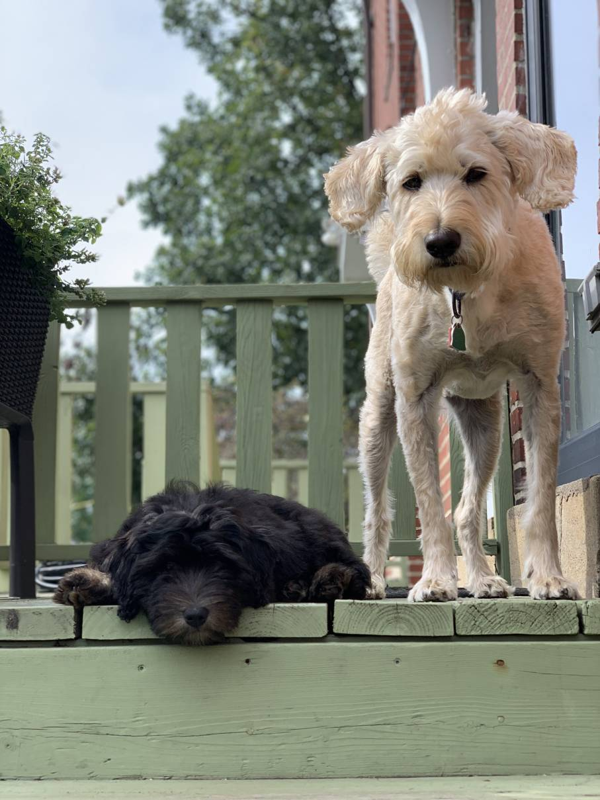

```{r setup, include=FALSE}
knitr::opts_chunk$set(echo = FALSE)

# Learn more about creating websites with Distill at:
# https://rstudio.github.io/distill/website.html

# Learn more about publishing to GitHub Pages at:
# https://rstudio.github.io/distill/publish_website.html#github-pages

```

This will be very aphasia friendly content about the website! For now, here's a picture of some cute puppies.




<div class="study">
<h4>A note from the National Library of Medicine</h4>
<em>Choosing to participate in a study is an important personal decision. Talk with your doctor and family members or friends about deciding to join a study. To learn more about this study, you or your doctor may contact the study research staff using the contacts provided below. For general information, <a href="https://clinicaltrials.gov/ct2/about-studies/learn">Learn About Clinical Studies.</a></em>
</div>
